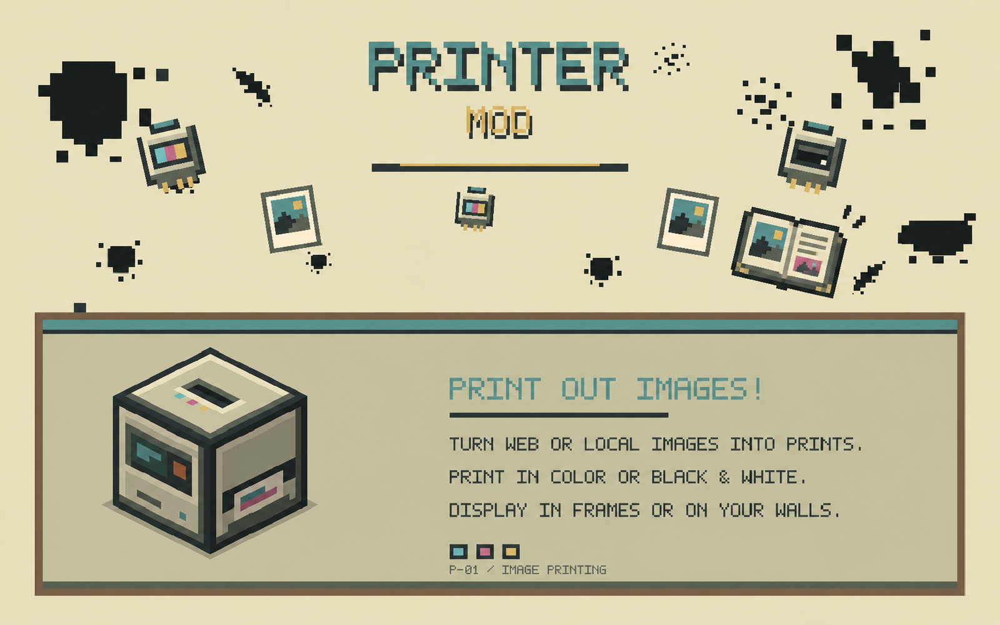

A mod for printing web and local images as items and wall displays with selectable background colors.

Upload an image URL or local file to the **Printer** block, select your background color and size, then collect your **Image** items to place on walls as decorative displays!

**0.1.1 requires a new world.** Worlds and printed Images from earlier versions are unsupported; there is no migration.

## What's up

- **Printer Block** prints images from URLs or local uploads. Place it, load cartridges, submit an image, and it outputs **Image** items. Hopper-compatible for automation.
- **Image Items** are reusable wall decorations displaying your printed images. Place them on any wall to create borderless displays with customizable background colors.
- **Transparent Backgrounds (0.1.1)**: right-click a placed Image with a Phantom Membrane to remove the printer's background, even a colored one. Costs one membrane in survival and keeps the original artwork's transparency. Opaque backgrounds already in the source picture stay part of the artwork.
- **Printer Sounds (0.1.1)** use pitched Minecraft clicks, piston strokes, and paper rustles, with no bundled audio files.
- **Photobook** collects and organizes all your printed images in a browsable book.
- **Color & Black Cartridges** power the printer for 3 prints each before needing replacement (realistic).
- **Create mod Integration** with create installed recipes are changed to use sequenced assembly.

## Server safety and storage

The server controls what images can be downloaded and how they're handled. **Only trust image URLs from people you know!!!** the printer can download from anywhere on the internet, so don't submit untrusted URLs. Images are stored on the server and deduplicated so multiple players can print the same image without hogging space. Your client keeps a local cache so images load smoothly. The server admin can set limits on image size, download speed, storage space, and which websites can be accessed.

## Attribution

- **Analog Audio** GUI inspiration
- **Immersive Paintings** Render code assistance
- **Image2Map** Inspiration for image mapping techniques
